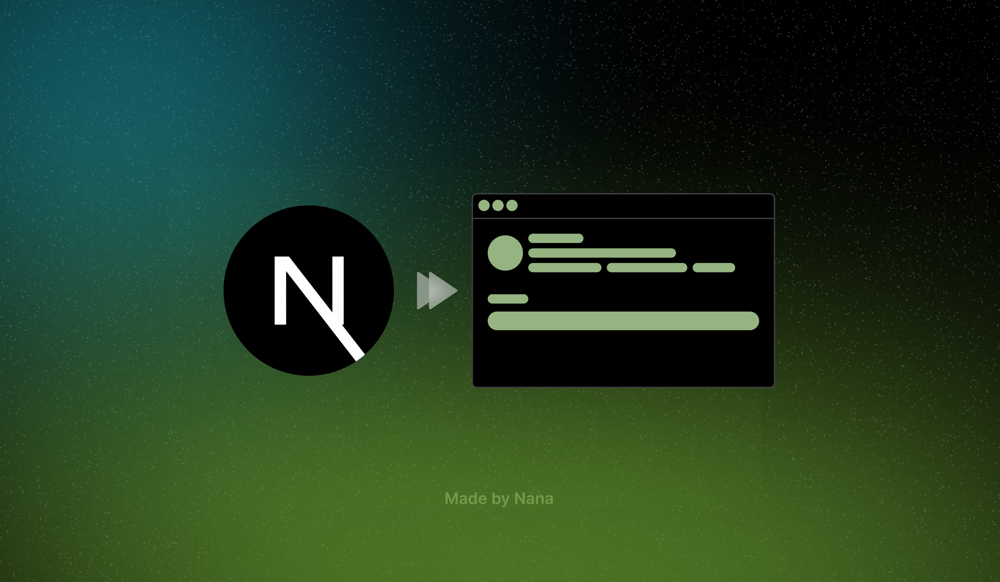
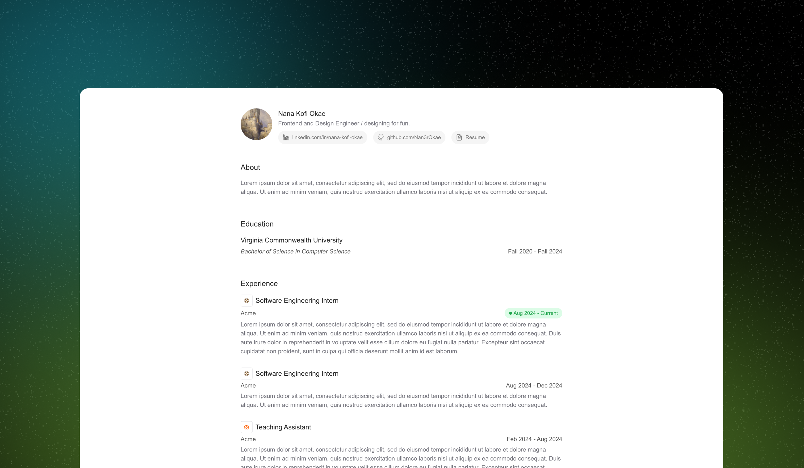
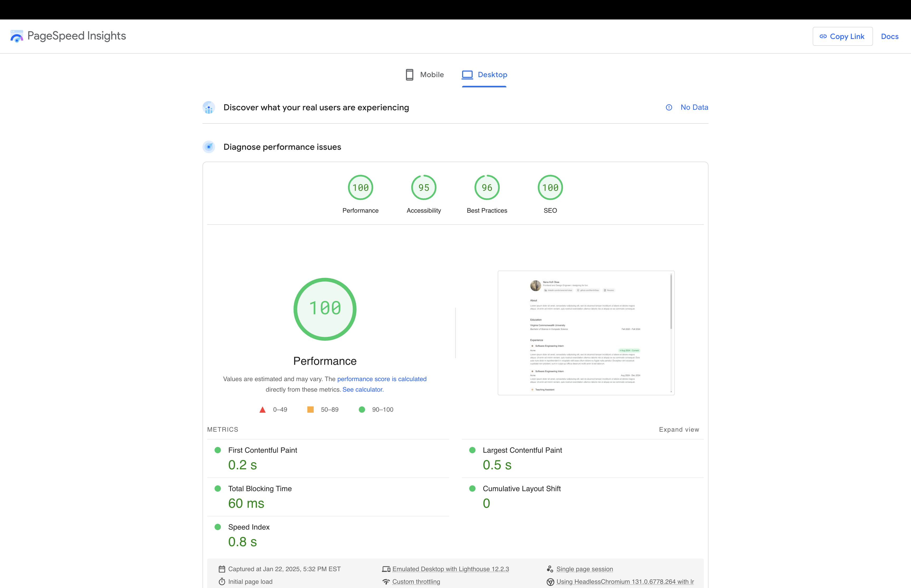

<h1 align="center">Next.js Portfolio Template</h1>

<p align="center">
  
</p>

<p align="center">
  A beautiful, customizable portfolio template built with Next.js, Tailwind CSS, and TypeScript. This is a perfect way to showcase your projects, skills, and experiences.
</p>

## Demo

<p align="start">
  
</p>

[View Demo](https://next-portfolio-template-og.vercel.app/)

<h1>Setting up your project</h1>

1. **Fork This Repository**:

   - Click the "Fork" button at the top right of this page to create a copy under your GitHub account.

2. **Clone Your Fork Repo**:

```bash
 git clone https://github.com/your-username/your-forked-repo.git
 cd your-forked-repo
```

3. **Run this command to install all dependencies needed for the project**:

```bash
   npm install
```

4. **Run the development server**:

```bash
npm run dev
# or
yarn dev
# or
pnpm dev
# or
bun dev
```

5. **Open [http://localhost:3000](http://localhost:3000) with your browser to see the result.**

**‼️ P.S. When developing and making changes, it's best practice to create a new branch for your work and submit a pull request for review before merging it into the main (or prod) branch. This ensures better collaboration, code quality, and minimizes the risk of introducing errors into production.**

<h1>Navigating this project</h1>

<details>
<summary><code>globals.css</code></summary>

```css
@tailwind base;
@tailwind components;
@tailwind utilities;

body {
  font-family: Arial, Helvetica, sans-serif;
  /* overflow: hidden; */
}

html,
body {
  margin: 0;
  padding: 0;
  overflow-x: hidden;
  scroll-behavior: smooth;
}

@layer base {
  :root {
    --background: 0 0% 100%;
    --foreground: 240 10% 3.9%;
    --card: 0 0% 100%;
    --card-foreground: 240 10% 3.9%;
    --popover: 0 0% 100%;
    --popover-foreground: 240 10% 3.9%;
    --primary: 240 5.9% 10%;
    --primary-foreground: 0 0% 98%;
    --secondary: 240 4.8% 95.9%;
    --secondary-foreground: 240 5.9% 10%;
    --muted: 240 4.8% 95.9%;
    --muted-foreground: 240 3.8% 46.1%;
    --accent: 240 4.8% 95.9%;
    --accent-foreground: 240 5.9% 10%;
    --destructive: 0 84.2% 60.2%;
    --destructive-foreground: 0 0% 98%;
    --border: 240 5.9% 90%;
    --input: 240 5.9% 90%;
    --ring: 240 10% 3.9%;
    --chart-1: 12 76% 61%;
    --chart-2: 173 58% 39%;
    --chart-3: 197 37% 24%;
    --chart-4: 43 74% 66%;
    --chart-5: 27 87% 67%;
    --radius: 0.5rem;
  }
  .dark {
    --background: 240 10% 3.9%;
    --foreground: 0 0% 98%;
    --card: 240 10% 3.9%;
    --card-foreground: 0 0% 98%;
    --popover: 240 10% 3.9%;
    --popover-foreground: 0 0% 98%;
    --primary: 0 0% 98%;
    --primary-foreground: 240 5.9% 10%;
    --secondary: 240 3.7% 15.9%;
    --secondary-foreground: 0 0% 98%;
    --muted: 240 3.7% 15.9%;
    --muted-foreground: 240 5% 64.9%;
    --accent: 240 3.7% 15.9%;
    --accent-foreground: 0 0% 98%;
    --destructive: 0 62.8% 30.6%;
    --destructive-foreground: 0 0% 98%;
    --border: 240 3.7% 15.9%;
    --input: 240 3.7% 15.9%;
    --ring: 240 4.9% 83.9%;
    --chart-1: 220 70% 50%;
    --chart-2: 160 60% 45%;
    --chart-3: 30 80% 55%;
    --chart-4: 280 65% 60%;
    --chart-5: 340 75% 55%;
  }
}

@layer base {
  * {
    @apply border-border;
  }
  body {
    @apply bg-background text-foreground;
  }
}

@layer components {
  .icons {
    @apply text-neutral-500 bg-neutral-100 px-3 py-2 rounded-full  text-xs md:text-sm flex gap-2 items-center hover:bg-neutral-200 transition-colors;
  }
  .icon-text {
    @apply max-sm:hidden;
  }
  .main-color {
    @apply text-muted-foreground;
  }
  .section {
    @apply mb-3 w-full flex flex-col gap-4;
  }
  .section-header {
    @apply text-muted-foreground text-xl text-neutral-800;
  }
  .text-title {
    @apply md:text-lg font-normal text-neutral-800;
  }
  .company-name {
    @apply text-neutral-600;
  }
  .card-section {
    @apply mt-6;
  }
  .date-text {
    @apply text-neutral-600;
  }
  .current-date {
    @apply text-green-600 bg-green-100 flex items-center gap-1  px-3 py-1 rounded-full;
  }
  .footer-container {
    @apply w-full max-w-4xl  flex md:flex-row flex-col justify-between px-4 py-8 gap-4;
  }
}
```

</details>

**globals.css:**
The global.css file defines the global styles for the project using Tailwind CSS and custom CSS rules. 

<details>
<summary><code>layout.tsx</code></summary>

```typescript
import type { Metadata } from "next";
import { Geist, Geist_Mono } from "next/font/google";
import "./globals.css";
import Footer from "@/components/Footer/Footer";
import { Analytics } from "@vercel/analytics/react";

const geistSans = Geist({
  variable: "--font-geist-sans",
  subsets: ["latin"],
});

const geistMono = Geist_Mono({
  variable: "--font-geist-mono",
  subsets: ["latin"],
});

//Please replace placeholders with your content for SEO
export const metadata: Metadata = {
  title: "Next.js portfolio template",
  description:
    "A next.js portfolio template for students to easily deploy and share more about themselves",
  icons: {
    //icon displayed in the browser tab and bookmarks
    icon: "favicon.ico",
  },
  //openGraph is used by platforms like Facebook, LinkedIn, and others to generate link previews when sharing a page.
  openGraph: {
    title: "Next.js portfolio template",
    description:
      "A next.js portfolio template for students to easily deploy and share more about themselves",
    url: "https://next-portfolio-template-og.vercel.app/",
    siteName: "Next.js portfolio template",
    images: [
      {
        url: "/template-images/next-template-image.png",
        width: 756,
        height: 440,
        alt: "portfolio-image",
      },
    ],
    locale: "en_US",
    type: "website",
  },
  twitter: {
    card: "summary_large_image",
    title: "Next.js portfolio template",
    description:
      "A next.js portfolio template for students to easily deploy and share more about themselves",
    images: ["/template-images/next-template-image.png"],
  },
};

export default function RootLayout({
  children,
}: Readonly<{
  children: React.ReactNode;
}>) {
  return (
    <html lang="en">
      <body
        className={`${geistSans.variable} ${geistMono.variable} antialiased`}
      >
        <main className="flex justify-center">{children}</main>
        <Footer />
        <Analytics />
      </body>
    </html>
  );
}
```

</details>

**layout.tsx:**
The layout.tsx file serves as the main layout component for your portfolio application. It sets up the structure, global styles, and essential metadata for the application, ensuring consistency and SEO optimization across all pages.

<details>
<summary><code>components/Experience/data.ts</code></summary>

```typescript
interface Experience {
  title: string;
  company: string;
  date: string;
  description: string;
  logo: string;
}

// You can update and add as many experiences you would like
// If you want to have the current badge, please add the (date - Current) to activate
export const experiences: Experience[] = [
  {
    title: "Software Engineering Intern",
    company: "Acme",
    logo: "/company-logos/logo-2.png",
    date: " Aug 2024 - Current",
    description:
      " Lorem ipsum dolor sit amet, consectetur adipiscing elit, sed do eiusmod tempor incididunt ut labore et dolore magna aliqua. Ut enim ad minim veniam, quis nostrud exercitation ullamco laboris nisi ut aliquip ex ea commodo consequat. Duis aute irure dolor in reprehenderit in voluptate velit esse cillum dolore eu fugiat nulla pariatur. Excepteur sint occaecat cupidatat non proident, sunt in culpa qui officia deserunt mollit anim id est laborum.",
  },
  {
    title: "Software Engineering Intern",
    company: "Acme",
    logo: "/company-logos/logo-2.png",
    date: " Aug 2024 - Dec 2024",
    description:
      " Lorem ipsum dolor sit amet, consectetur adipiscing elit, sed do eiusmod tempor incididunt ut labore et dolore magna aliqua. Ut enim ad minim veniam, quis nostrud exercitation ullamco laboris nisi ut aliquip ex ea commodo consequat.",
  },
  {
    title: "Teaching Assistant",
    company: "Acme",
    logo: "/company-logos/logo-3.png",
    date: "Feb 2024 - Aug 2024",
    description:
      " Lorem ipsum dolor sit amet, consectetur adipiscing elit, sed do eiusmod tempor incididunt ut labore et dolore magna aliqua. Ut enim ad minim veniam, quis nostrud exercitation ullamco laboris nisi ut aliquip ex ea commodo consequat. Duis aute irure dolor in reprehenderit in voluptate velit esse cillum dolore eu fugiat nulla pariatur. Excepteur sint occaecat cupidatat non proident, sunt in culpa qui officia deserunt mollit anim id est laborum.",
  },
];
```

</details>

**data.ts for Experience:**
The data.ts file located in the experience folder is where you can define all your experience details. Simply add as many objects as needed to the array, and they will automatically be mapped and displayed within the **experience component**.

<details>
<summary><code>components/Projects/data.ts</code></summary>

```typescript
interface Projects {
  name: string;
  href: string;
  description: string;
  date: string;
  stack: string[];
}

//You can add as many tech stack icons here
export const techIcons: { [key: string]: string } = {
  "Next.js": "/Icons/next.svg",
  "React.js": "/Icons/react.svg",
  Typescript: "/Icons/typescript.svg",
  "Node.js": "/Icons/node.svg",
  PostgreSQL: "/Icons/PostgreSQL.svg",
  Firebase: "/Icons/firebase.svg",
  Python: "/Icons/python.svg",
  Javascript: "/Icons/javascript.svg",
};

// You can update and add as many experiences you would like
export const projects: Projects[] = [
  {
    name: "Todo App",
    href: "https://www.nanakofiokae.com/",
    description:
      "Lorem ipsum dolor sit amet, consectetur adipiscing elit, sed do eiusmod tempor incididunt ut labore et dolore magna aliqua. Ut enim ad minim veniam, quis nostrud exercitation ullamco laboris nisi ut aliquip ex ea commodo consequat.",
    date: "May 2022",
    //The array will show the list based on how it is typed, ensure what the techIcon text is is exactly the same as you have it in this stack array
    stack: ["Next.js", "React.js", "Typescript", "Node.js"],
  },
  {
    name: "Pokemon Database",
    href: "https://www.nanakofiokae.com/",
    description:
      "Lorem ipsum dolor sit amet, consectetur adipiscing elit, sed do eiusmod tempor incididunt ut labore et dolore magna aliqua. Ut enim ad minim veniam, quis nostrud exercitation ullamco laboris nisi ut aliquip ex ea commodo consequat.",
    date: "May 2023",
    stack: [
      "Next.js",
      "React.js",
      "Typescript",
      "Node.js",
      "PostgreSQL",
      "Firebase",
      "Python",
    ],
  },
  {
    name: "Calculator App",
    href: "https://www.nanakofiokae.com/",
    description:
      "Lorem ipsum dolor sit amet, consectetur adipiscing elit, sed do eiusmod tempor incididunt ut labore et dolore magna aliqua. Ut enim ad minim veniam, quis nostrud exercitation ullamco laboris nisi ut aliquip ex ea commodo consequat.",
    date: "May 2024",
    stack: ["Next.js", "Javascript", "Python"],
  },
];
```

</details>

**data.ts for Projects:**
The data.ts file in the projects folder is where you can define all your project details. Add as many objects as you'd like to the array, and they will automatically be mapped and displayed within the **project component**.

**Public folder:**
The public folder holds all of your images, icons, resume(s) and etc. You can update this folder with more content related to your project needs. 

<h1>Why should you use this template❓</h1>

1. **Because, it's cool!**

2. **Clean and scalable code.**

3. **SEO optimized.**

4. **Great web performance.**
<p >
  
</p>

5. **Ready to deploy in minutes!**

6. **Mobile responsive.**

<h1>Deploying on vercel</h1>

[Vercel Platform](https://vercel.com/new?utm_medium=default-template&filter=next.js&utm_source=create-next-app&utm_campaign=create-next-app-readme).

**Once you have made all the neccessary changes, you need to run:**

```bash
npm run build
```

## The importance of <code style="color: #e63946;">npm run build</code> 


1. **Optimized Production Build:**
   
- This command creates an optimized production version of your portfolio application --- minimizing file sizes and improving performance.

2. **Error Detection:**

- The build process helps catch potential errors that might occur in production, such as incorrect imports or issues with external dependencies.

3. **Deployment Readiness:**

- Most deployment platforms, including Vercel, expect a production-ready build. Without running this command, your application might fail to deploy or function improperly.

## Deploying your portfolio

1.  **Import the portfolio repo.**
2.  **Click Deploy.**
3.  **Now you have a fully functional portfolio ready to showcase. 🎉**


Want to learn more? Check out their [Next.js deployment documentation](https://nextjs.org/docs/app/building-your-application/deploying) for more details.
